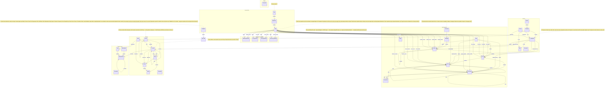

```mermaid
classDiagram
direction TB

namespace Requirements {
    class Stakeholder
    class User
    class Requirement
    class RequirementsConstraint["Constraint"]
}

namespace Domain {
    class Group
    class Service
    class Actor
    class Entity
    class Event
    class Value
    class DomainConstraint["Constraint"]
}

namespace Solution {
    class Person
    class Role
    class Component
    class Container
    class System
    class SolutionConstraint["Constraint"]
}

namespace Implementation {
    class ImplementationConstraint["Constraint"]
    class Language
    class Module
    class File
    class Struct
    class Function
    class Agent
    class Unresolved
    class Note
}

namespace Global {
    class GlobalConstraint["Constraint"]
}

namespace TransientPlan {
    class Plan
    class PlanPhase
    class Task
    class Feedback
}

namespace PlannedImplementation {
    class PlannedModule["Module (planned)"]
    class PlannedFile["File (planned)"]
    class PlannedStruct["Struct (planned)"]
    class PlannedFunction["Function (planned)"]
}

%% `reviews` targets any authored node, plan artifact, or code unit (the Reviews
%% rel table's full target set, listed in the Feedback note below); this box is
%% a wildcard, not a node type.
class ReviewedNode["any node"]

%% Cardinalities:
%% 1     = exactly one
%% 1..*  = one or many
%% 0..1  = zero or one
%% 0..*  = zero or many
%% Unmarked endpoints have unspecified cardinality.

%% ==================================================
%% TIER 1 — REQUIREMENTS
%% ==================================================

Stakeholder --> "1..*" Requirement : requires
User --> "1..*" Requirement : requires
Requirement --> "0..*" Requirement : contains

%% ==================================================
%% TIER 2 — DOMAIN
%% ==================================================

%% Containment
Group --> "0..*" Group : contains
Group --> "0..*" Service : contains
Group --> "0..*" Entity : contains
Entity --> "1..*" Value : contains
Event --> "1..*" Value : contains

%% Event is a kind of Entity
Entity <|-- Event

%% Interactions — may cross Groups
Service --> "0..*" Service : calls
Actor --> "1..*" Service : calls
Service --> "0..*" Event : publishes
Service --> "0..*" Event : subscribes
Actor --> "0..*" Event : subscribes

%% Data access — private to Group
Service --> "0..*" Entity : reads
Service --> "0..*" Entity : writes

%% Requirements / domain links
Service --> "1..*" Requirement : driven-by
Actor --> "1..*" User : represents

%% ==================================================
%% TIER 3 — SOLUTION
%% ==================================================

System --> "1..*" Container : contains
Container --> "1..*" Component : contains
Person --> "1..*" Component : uses
Component --> "1" Role : is-role
Container --> "1" Role : is-role

%% Solution / domain links
Person --> "1..*" Actor : represents
Component --> "1..*" Service : realises

%% ==================================================
%% TIER 4 — IMPLEMENTATION (SCANNED)
%% ==================================================

%% Constraints
ImplementationConstraint --> "0..*" Language : applies-to

%% Containment
Language --> "0..*" Module : contains
Module --> "0..*" Module : contains
Module --> "0..*" File : contains
File --> "0..*" Struct : contains
File --> "0..*" Function : contains
Struct --> "0..*" Struct : contains
Struct --> "0..*" Function : contains

%% Dependencies
Struct --> "0..*" Struct : uses
Function --> "0..*" Struct : uses
Function --> "0..*" Function : calls

%% Unresolved references
Struct --> "0..*" Unresolved : uses
Function --> "0..*" Unresolved : uses
Function --> "0..*" Unresolved : calls

%% Attached documentation
Note --> "0..1" Module : details
Note --> "0..1" File : details
Note --> "0..1" Struct : details
Note --> "0..1" Function : details

%% Solution / implementation links
Component --> "0..*" Module : implemented-by
Component --> "0..*" File : implemented-by
Component --> "0..*" Struct : implemented-by
Component --> "0..*" Function : implemented-by

%% ==================================================
%% PLAN — TRANSIENT
%% ==================================================

Plan --> "1..*" PlanPhase : contains
PlanPhase --> "1..*" Task : contains
Task --> "1" Agent : assigned-to
Task --> "0..1" Component : implements

%% Module operations
Task --> "0..1" Module : module_modify
Task --> "0..1" Module : module_delete
Task --> "0..1" Module : module_move
Task --> "0..1" Module : module_rename
Task --> "0..1" PlannedModule : module_create
Task --> "0..1" PlannedModule : target

%% File operations
Task --> "0..1" File : file_modify
Task --> "0..1" File : file_delete
Task --> "0..1" File : file_move
Task --> "0..1" File : file_rename
Task --> "0..1" PlannedFile : file_create
Task --> "0..1" PlannedFile : target

%% Struct operations
Task --> "0..1" Struct : struct_modify
Task --> "0..1" Struct : struct_delete
Task --> "0..1" Struct : struct_move
Task --> "0..1" Struct : struct_rename
Task --> "0..1" PlannedStruct : struct_create
Task --> "0..1" PlannedStruct : target

%% Function operations
Task --> "0..1" Function : function_modify
Task --> "0..1" Function : function_delete
Task --> "0..1" Function : function_move
Task --> "0..1" Function : function_rename
Task --> "0..1" PlannedFunction : function_create
Task --> "0..1" PlannedFunction : target

%% Feedback — one review item, attached to exactly one target
Feedback --> "0..*" ReviewedNode : reviews

%% ==================================================
%% NOTES
%% ==================================================

note for Group "A Group contains either subgroups or leaf contents, never both; a leaf Group — a Group with no subgroups — holds Services and Entities and at least one Service."
note for Service "Calls, publishes, and subscribes may cross Groups. Reads and writes are private to Group."
note for Component "A Component claims many code nodes; each code node is claimed by exactly one Component, never shared, and the merge gate requires every Component to claim at least one code node."
note for ImplementationConstraint "An implementation constraint binds all of tier 4 unless it carries one applies-to edge per Language it binds; every applies-to target is a Language node."
note for Agent "One per definition file under `.opencode/agents/`, its FQN `agent.<file-stem>` — the extension-stripped file name, e.g. `agent.go-frontend-implementer` — located at that file's path and line span."
note for Plan "One per project."
note for Task "A task's own properties are title and status; its assigned Agent, the Component it implements, and the code it touches are edges. Every task assigns exactly one Agent. Move/rename: operation edge to existing source plus target edge to matching planned destination. Create: operation edge to planned destination only. Target-less tasks are allowed for no-change activities."
note for Feedback "A review item attached to exactly one target; reviews targets any Module, Function, Struct, File, Requirement, Plan, PlanPhase, Task, Stakeholder, Entity, System, Container, Component, User, DomainGroup, Value, Service, Person, Constraint or Note. A new Feedback is open with an empty disposition; the coordinator's action sets actioned with disposition fixed or wont-fix; the reviewer's resolve sets resolved (terminal), while reject returns it to open with disposition rejected. An artifact is done only when every Feedback on it is resolved — apg plan complete and the verify gate refuse otherwise."
```